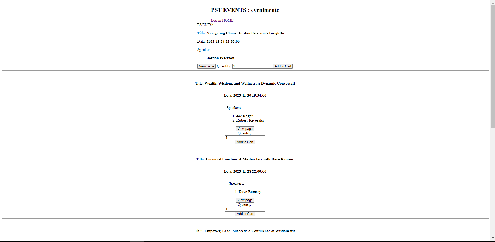
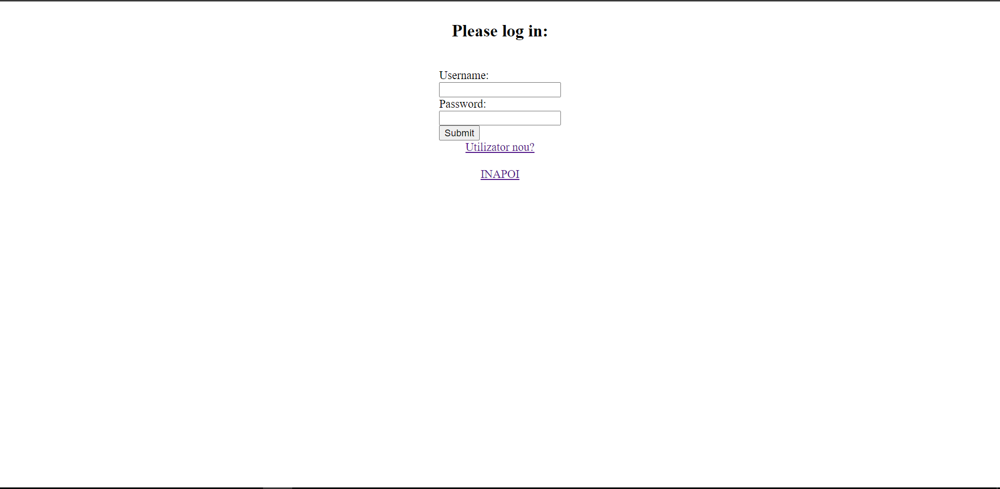
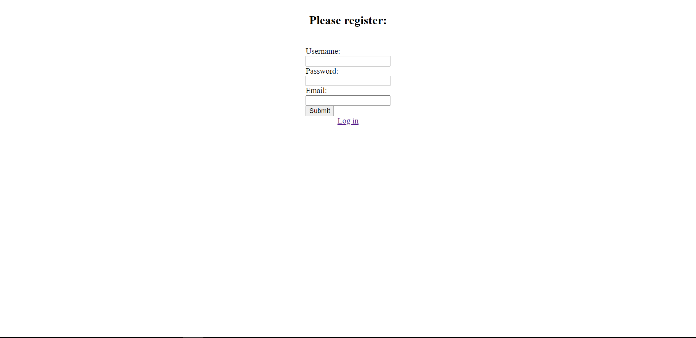
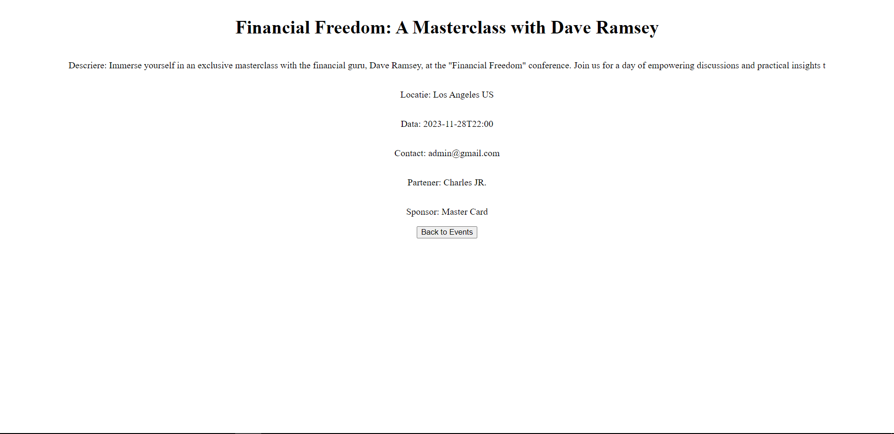
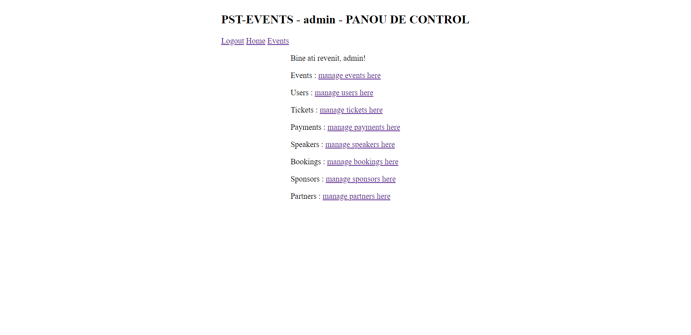
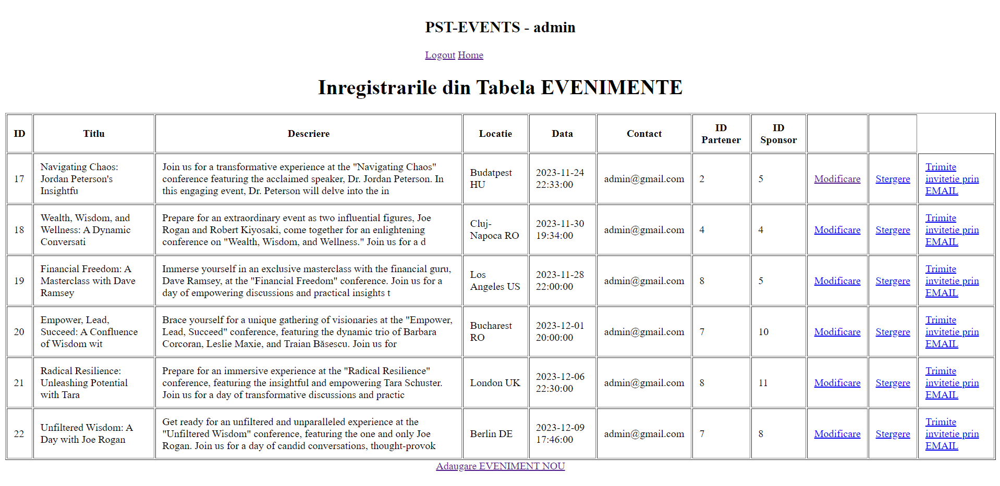

Admin functionality:
-CRUD - for every table in the DB
-Generate new event page when new event added

User functionality:
-see events
-buy tickets

Main page:

To add ticket to logging in / registering is needed

WHEN LOGGED AS USER:
- view more details about the event found on the main page by clicking view event

WHEN LOGGED AS ADMIN:
-Control panel

CRUD for one of the tables - EVENTS
+ send email invitation to event

